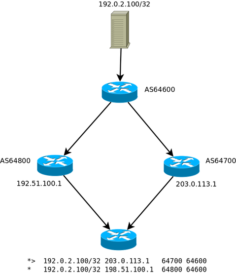
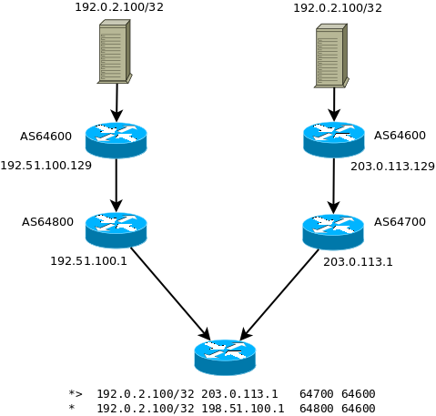

Title: Anycast routing
Date: 2018-02-28 05:54:00
Category: Networking
Tags: routing, anycast, bgp

It is well known that due to limited practical size of a UDP packet that can be transmitted without
fragmentation, the number of DNS root servers is limited to 13 addresses. There are indeed 13 root servers
named from A to M (a.root-servers.net, b.root-servers.net and so on).

However, if you visit [root-servers.org](http://root-servers.org/), you can see that most of those servers
somehow have dozens and even hundreds locations around the world. How is it possible for one server to
have more than one location? The answer is _anycast routing_.

Unlike multicast, which requires that all participants including clients support the special routing mechanism,
anycast is indistinguishable from unicast for clients, servers, and most routers. In IPv4, it's simply a special
type of network design and routing protocol configuration that is indistinguishable from unicast for any host
involved in it. In this article we assume the protocol is IPv4.

Consider a typical multihomed autonomous system:

The AS64600 has a single router that is advertising 192.0.2.100/32 prefix  to two different networks, AS64700 and AS64800. The fourth router (whose AS is unimportant)
is also connected to both of them. In its BGP table, there are two paths to 192.0.2.100, via 203.0.113.1 with AS path 64700 64600 and another one via
198.51.100.1 with AS path 64600 64600. It's a pretty good redundancy, shall any of links between that router and AS64600 fail, traffic will still flow through the
remaining link as expected. However, if something happens to the AS64600 site itself, redundant links will not help at all.

Now the key idea is that an autonomous system is simply &ldquo;a group of networks under single administration&rdquo;. There's nothing in BGP or any other protocol
that places any limitations on the internal topology of an AS and connectivity between its parts. In fact, there may not be direct connection between its parts at all.

To ensure that the service provided by the 192.0.2.100 server will remain available even if that site fails, we can setup another server and another router
at a different site and configure them in exactly the same way.

The BGP table of the client router will not change at all, it will remain completely unaware of any change at all, much less of the unusual configuration.
The routers of AS64700 and AS64800  will now have two different paths to 192.0.2.100, one directly connected and nother one through each other (assuming they are peering
with each other), but by looking at `show ip bgp` output there's still no way to find out if it's anycast or the sites of AS64600 have a direct connection between each other
that is invisible to us. At the network layer, it all looks like anycast.

Apart from redundancy, anycast provides transparent load balancing. Since BGP routers will use the shortest path, they will automatically choose the site closest to them,
in terms of AS path anyway.

However, lack of any distinction from unicast at the network level is a double edged sword. While it means no special configuration of clients of servers is required
to get the routing and load balancing to work, it also means there is no way to control which site receives client traffic, or even a guarantee that all requests from
the same client will be received by the same site. For this reason anycast is best suited for stateless services such as DNS, or web servers with static content (CDNs),
and it still needs a way to keep those servers synchronized. Despite its limitations, it still a very valuable tool though, definitely good enough to maintain
high availability of critical components of the Internet infrastructure such as DNS root servers.

