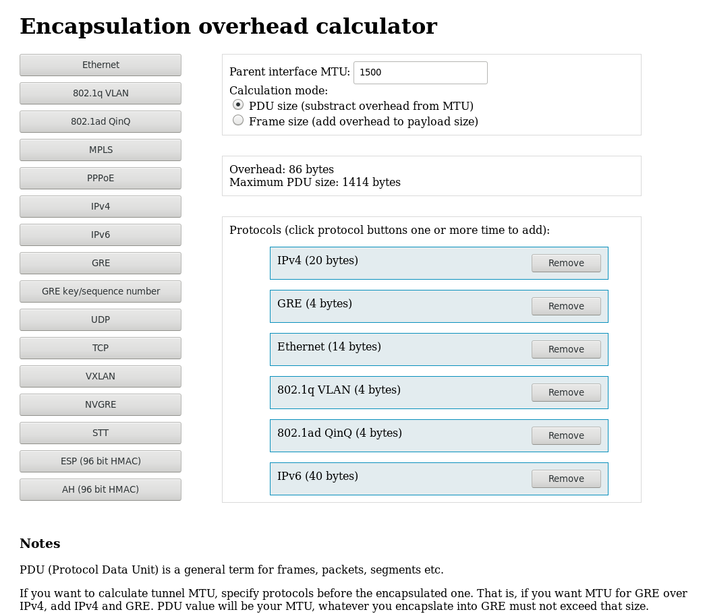
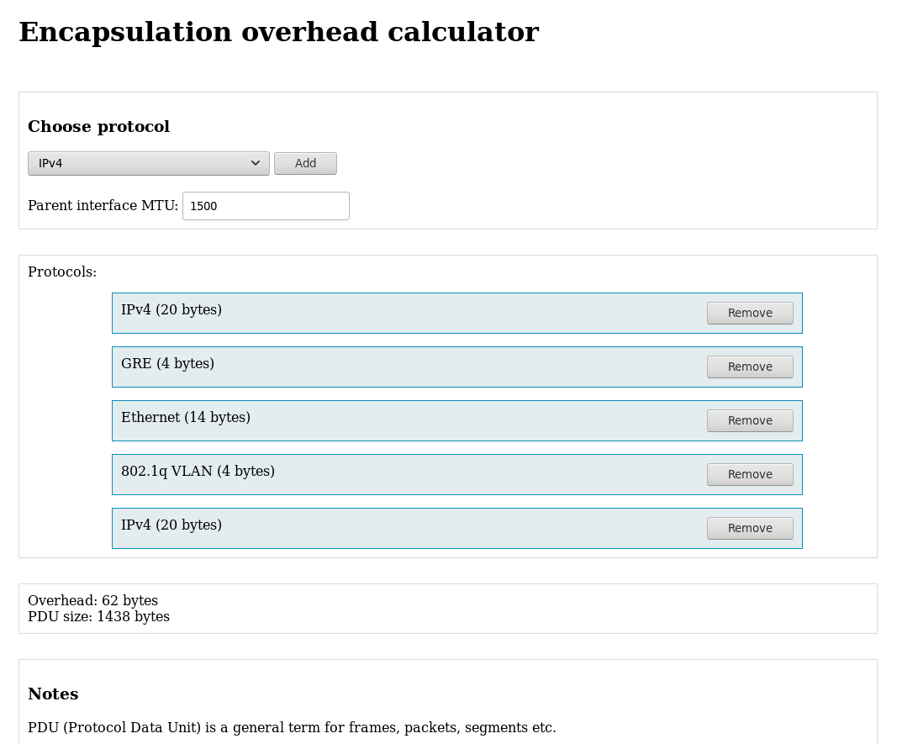

Title: MTU calculator makeover
Date: 2018-03-14 19:26:03
Category: Development
Tags: mtu, tunnel, web

A new version of encapcalc the MTU/MSS calculator is now live at [https://baturin.org/tools/encapcalc](https://baturin.org/tools/encapcalc).

## What's new?

* Updated, more mobile device friendly UI
* Calculating frame size from payload in addition to calculating PDU from parent MTU
* Support for ESP and AH with 96-bit HMAC (contributed by [Zmegolaz](https://github.com/Zmegolaz/))

This is what the new UI looks like on desktop:

...and on mobile:

## The complete story

Encapcalc remained nearly unchanged since 2013, save for addition of a few protocols. It's a long enough time to at least check
if some improvements can be made, even if it does its job well and people are using it every day.

These days there are way more mobile device users than five years ago. I'm not fond of mobile devices myself,
but I decided to check what using it on a mobile device would be like and found that it's an absolutely miserable
experience. And that's not entirely mobile device fault &mdash; a dropdown list that you get to use repeatedly
is simply a clunky UI that is not good for desktop either, just tolerable. For _n_ protocols, you need _3n_ clicks,
which is not nice.

This is what the old UI was like on desktop:

On mobile though... First I discovered that I set the main wrapper box width to 1000px. That's right, `width: 1000px`.
I'm pretty sure I meant `max-width: 1000px` because what I actually wrote is evil and rude even on desktop, and on a
smartphone it guarantees that the box will always be wider than screen. That's an easy fix though.

Now to the _3n_ clicks problem. On mobile devices it's aggravated by their handling of drop-down lists. Android does
_relatively_ well there, while iOS uses zoom I never asked it for, which requires even more actions to view the result.

Since there are only that many network layer and tunneling protocols in the world, I decided to not use a dropdown list
at all, but rather create a button for every protocol. First I thought I will arrange them in two or three columns 
for portrait orientation, but then I found that having them all on the left is more or less usable even in portrait orientation.

Besides, there's another UI problem &mdash; the calculation results eventually goes below the bottom edge of the screen as
you add more protocols. It's especially apparent on mobile, but with enough protocols in the list you run into it on desktop
as well. So I decided to move that box above the protocol list to keep it always visible.

[Ray Soucy](http://soucy.org) who volunteered to beta test it said it would be nice to be able to calculate the frame size
from a known payload size in addition to calculating PDU from a known parent interface MTU. The only difference is whether to
add or substract the value, so I thought it makes good last moment addition. The descriptions of the field also change as you
switch between those modes to reflect what is being calculated from what.

## Conclusion

I hope these changes will make the calculator easier to use for people on all platforms. 
If you find any problems with it, please contact me or open an issue in the github repo.
